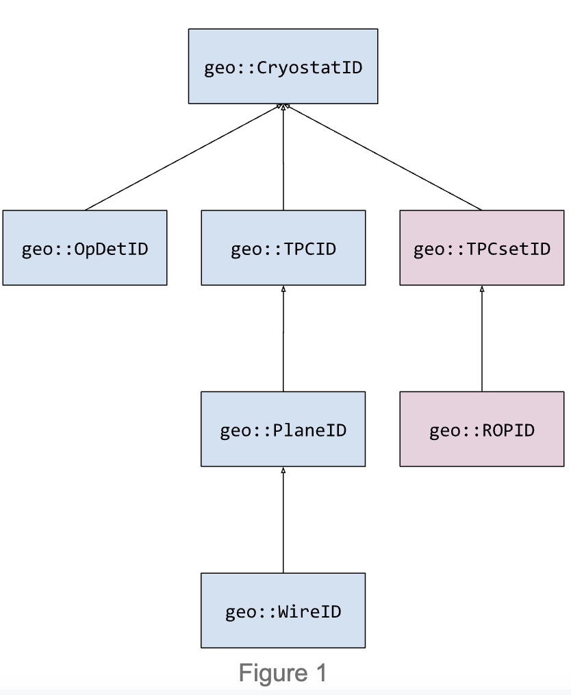

# LArSoft V10+ geometry system overview for users and detector geometry developers.


# Goal of this page
This page is for people who need to use or write their own detector geometry. Section 1 describes the overall structure of the geometry system. An overview of the specific classes, identifiers, navigation and iteration tools follows in Sect. 2. (Please refer to the classes themselves for details of the information available from each class.) Sect. 3 then describes the features that allow customization of the geometry for specific LArTPC-based experiments.

# 1. High-level structure of the LArSoft geometry
The existing geometry model is supported by three sub-systems, each with a separate art service / LArSoft service provider:

- The core geometry (geo::GeometryCore), which manages the physical volumes,
- An experiment-customizable readout geometry that uses the core geometry to associate readout concepts (such as “channels”) to geometry objects (such as “wires” or “pixels”).  The readout geometry:
  - is customizable by each experiment (“standard” wire-based readout available)
  - chooses the procedures to sort readout elements (e.g. `geo::WireReadoutSorter`)
  - chooses the implementation of the wire or pixel readout (e.g. `geo::WireReadoutGeom`)
  - maps logical readout channels to and from wires or pixels
  - Provides access to view and signal type of planes for wire readouts
  - Provides the “coordinate” of a point corresponding to the nearest wire or pixel
- An auxiliary geometry (`geo::AuxDetGeometryCore`) that supports geometry elements outside of the cryostats.
For jobs that run in art, a geometry configuration writer service can be enabled that will store the current geometry configuration in run records, so that subsequent jobs can check that the geometry used is the same.
These sub-systems are described in more detail below.

# Core Geometry 

The class that describes the physical geometrical volumes is the geo::GeometryCore provider, which is normally accessed within a framework job through the geo::Geometry service.  (For details on the structure of LArSoft services and providers, see [Here][https://larsoft.github.io/LArSoftWiki/Writing_LArSoft_service).) The `geo::GeometryCore` is not experiment-customizable but is intended to represent the physical volumes common to all LAr TPC detectors supported by LArSoft.  It is responsible for:

* managing the ROOT geometry description and its GDML source
* providing access to the LArSoft description of physical-volume detector components
* facilitating volume-geometry iteration on detector components by type
* maintaining relations between components

As of LArSoft v10, the physical volumes accessible through `geo::GeometryCore` include the cryostats and all TPCs and optical detectors within each cryostat (`geo::CryostatGeo`, `geo::TPCGeo`, and `geo::OpDetGeo`, respectively).

To load the geometry in an art framework job, the following should be part of the configuration:

```
services.Geometry: {
  SortingParameters: { tool_type: MyGeoObjectSorter ... }
  ... 
}
```
## Optical geometry
LArSoft assumes that optical detectors are directly contained by cryostats.  Consequently all optical-geometry information is provided through the `geo::GeometryCore` provider.

# Readout geometry
 Whereas all TPCs contain cathodes and anodes, the manner in which signals are read from the anodes varies.  Because of this variation in readout approaches, as of LArSoft v10, the readout geometry is separated from and layered on top of the main geometry system.  This allows the readout geometry to still be aware of universal LArTPC geometry concepts while supporting the specific readout approach.

LArSoft supports the abstract `geo::WireReadoutGeom` provider, which is enabled in the art framework as the `geo::WireReadout` service.  Experiments inherit from the `geo::WireReadoutGeom` provider to express wire-readout behavior specific to their detector(s).  Like the main geometry system, readout elements may be iterated through using the interface discussed below [LINK TO “Element iteration”].

To use the readout geometry in an art job, users should include the following in their job configuration:
```
services.WireReadout: { 
  service_provider: ExperimentSpecificWireReadout
  SortingParameters: { tool_type: MyWireReadoutSorter ... }
  ... 
}
```
LArSoft will soon support the `geo::PixelReadoutGeom` provider for pixel readouts. 

# Auxiliary geometry

As mentioned [HERE], LArSoft supports an auxiliary geometry system (represented by the  `geo::AuxDetGeometryCore class`) that contains elements not part of the LArTPC cryostats.  When constructing the auxiliary geometry, any elements labeled “volAuxDet” within the GDML file will be represented as `geo::AuxDetGeo` objects and owned by the `geo::AuxDetGeometryCore` instance.  Each of the `geo::AuxDetGeo` objects in turn contain `geo::AuxDetSensitiveGeo` objects, which correspond to volumes within the GDML that are marked sensitive for Geant4’s use.  How these volumes are used is experiment-specific, and users should refer to their experiment’s guidance.  

As of LArSoft v10, the auxiliary geometry is not automatically loaded with the rest of the main geometry system.  To load it in an art framework job, the following should be part of the job configuration:
```
services.AuxDetGeometry: {
  SortingParameters: { tool_type: MyAuxDetSorter ... }
  ReadoutInitializer: { tool_type: MyAuxDetInitializer ... }
  ... 
}
```
Initialization of the auxiliary geometry system is a specialized topic and discussed more fully below [LINK TO “Writing your own auxiliary geometry initializer”].

# Geometry configuration writer

In the context of multi-stage workflow, it is necessary to use the same geometry for each stage.  To help ensure this, there is a dedicated art framework service called `GeometryConfigurationWriter`, which inserts basic metadata about the geometry into each art::Run object.  When encountering a new run, the metadata of the current geometry is checked against any stored metadata from a previous stage.  If an incompatibility is detected, an exception will be thrown by the service, ending the framework job.  To enable this service as part of a framework job, a user should include the following as part of a job configuration:
```
services.GeometryConfigurationWriter: {}
```
# 2. Core Geometry elements

LArSoft supports the `geo::CryostatGeo, geo::TPCGeo, and geo::OpDetGeo` classes (representing physical geometry characteristics), and the `geo::PlaneGeo` and `geo::WireGeo` classes (representing readout elements).  (Additional elements will become available when pixel readouts are fully implemented.) Although the exact interface depends on the class, each class provides position and physical-extent information as well as an identifier to disambiguate one instance from another.  In addition, the geometry system provides a reverse lookup mapping so that, given a particular point in 3D space, the corresponding (or closest) geometry element can be inspected.

Note that the wire readout element `geo::WireGeo` represents a single physical wire placement in a single TPC. Cases where multiple physical wires are connected to the same logical readout channel are handled in the mapping between wires and logical readout channels. Cases where one physical wire is split between two logical readout channels also occur. These are currently handled by creating two logical wires, one for each logical readout channel. See [HERE “Designing a geometry to fit in LArSoft”] for more details.

## Element identifiers
Each geometry element is identified by a unique combination of numbers according to its inclusion in the geometrical hierarchy.  The identifier of an element is a C++ class that inherits from the identifier of its parent (if one exists).  The hierarchy is shown below.


With this pattern, any interface expecting a certain ID type can also accept arguments of derived types.  For example:

```
// Get TPC 2 from cryostat 1
geo::TPCGeo const& tpc1 = geom->TPC(geo::TPCID{1, 2});

// Get TPC corresponding to wire 4 from plane 3 of TPC 2 from cryostat 1
geo::TPCGeo const& tpc2 = geom->TPC(geo::WireID{1, 2, 3, 4});

// They refer to the same TPC.
assert(tpc1 == tpc2);

```
All identifiers are zero-based and numbered compactly.  For example:
- The first cryostat has an ID of `geo::CryostatID{0}`.
- The first TPC in the first cryostat has an ID of `geo::TPCID{0, 0}`, where the first number is the index of the first cryostat, and the second number is the index of the first TPC within that cryostat.
- For cryostat 0 with n TPCs, the TPC index values range from 0 to n - 1, resulting in `geo::TPCID` values of {0, 0} to {0, n-1}.
- The pattern continues down the hierarchy, adding another number to the identifier depending on which level of the hierarchy the element resides.

The identifier system is not closed: a user may wish to inherit from one of the above identifier classes as a means of extending the hierarchy.  However, the geometry system interface may not be able to intelligently make use of the new identifier depending on what is desired.  In such cases, the user should contact LArSoft developers for guidance.

N.B. The auxiliary detector system is not included as part of the element identifier hierarchy.

# Element iteration

An important feature of the geometry system is the ability to iterate through the geometry elements, as defined [HERE].  This is done by using the `Iterate<T>` interface provided by `geo::GeometryCore` and `geo::WireReadoutGeom` providers.  For example, to iterate through wire IDs:

```
// Iterate through all wire IDs in the detector
for (auto const& wireID : wireReadoutGeom->Iterate<geo::WireID>()) { 
  ...
}

// Iterate through all wire IDs in cryostat 1
for (auto const& wireID : wireReadoutGeom->Iterate<geo::WireID>(geo::CryostatID{1})) { 
  ...
}
```

The iteration system is also designed to work seamlessly with geometry elements as well, so that if iteration over the elements themselves were desired, the ID suffix of “Iterate<*ID>”  can be replaced with “Iterate<*Geo>”:

```
// Iterate through all wire objects in the detector
for (auto const& wireGeo : wireReadoutGeom->Iterate<geo::WireGeo>()) { 
  ...
}

// Iterate through all wire objects in cryostat 1
for (auto const& wireGeo : wireReadoutGeom->Iterate<geo::WireGeo>(geo::CryostatID{1})) { 
  ...
}
```

# Iteration order and sorting

The order in which the above iteration occurs depends on the sorting algorithm specified by the user when constructing the geometry system.  This specification happens when (a) explicitly constructing the geometry system in C++ code,  or (b) constructing the geometry through a framework configuration file.

Sorting happens upon construction of the geometry system.  After all geometry elements have been loaded into memory, the geometry tree is traversed downward from the top-most volume, sorting each set of elements as they are visited.  For example, all cryostats are sorted first, then all TPCs contained by each cryostat are sorted, etc.  LArSoft provides standard, default sorters for each of its geometry systems.  Those interested in creating and enabling their own sorting algorithms should refer to the section below on writing your own geometry element sorter.


More to come.
